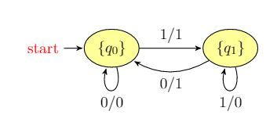

# mealy_fsm_cpp
Implementación (extremadamente) simple de un codificador/decodificador basado en [Máquina de Mealy](https://en.wikipedia.org/wiki/Mealy_machine) para las práticas de la asignatura Modelos de Computación del Grado en Ingeniería Informática, Universidad de Granada.

### Decodificador 

- Si el *estado anterior* corresponde con **0** entonces: 0 - > 0 y 1 - > 0
- Si el *estado anterior* corresponde con **1** entonces: 1 - > 1 y 1 - > 0
- Estaremos en el estado inicial **qo** si se ha leído un 0 y en el estado **q1** si se ha leído un 1 

### Codificador 

